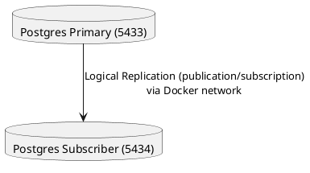

# PostgreSQL Logical Replication – Local Docker Demo


---

## Summary

This project demonstrates **PostgreSQL logical replication** between two Docker containers on your machine, including full automation and robust integration tests for inserts, updates, and deletes.

* **No cloud or network config needed**: Runs on your local machine
* **Integration-tested**: Inserts, updates, deletes—replication is verified end-to-end

---

## Architecture



* **Primary**: `postgres-db` database, runs on port **5433** (localhost)
* **Subscriber**: `replication-db` database, runs on port **5434** (localhost)
* **Replication**: asynchronous, real-time via publication/subscription

---

## Project Structure

```
.
├── docker-compose.yml
├── setup.sh
├── primary/
│   ├── postgresql.conf
│   └── pg_hba.conf
└── schema.sql (temporary, generated by setup)
```

---

## Usage (Quickstart)

**Requirements:** Docker, Docker Compose, Bash

1. **Clone the repo and enter it:**

   ```sh
   git clone <your-repo-url>
   cd postgresql-replication
   ```

2. **Make sure you have:**

   * `primary/postgresql.conf`
   * `primary/pg_hba.conf`
   * (see below for sample config)

3. **Make setup script executable:**

   ```sh
   chmod +x setup.sh
   ```

4. **Run everything (setup, replication, tests):**

   ```sh
   ./setup.sh
   ```

---

## What happens in `setup.sh`?

* Brings up both Postgres containers and waits for them.
* Sets up logical replication (publication/subscription) **after creating all test tables**.
* Creates and replicates a basic test table; verifies a single-row replication.
* **Integration tests:**

  * Inserts 100 rows in a bulk test table; checks all 100 rows appear in subscriber.
  * Updates all rows in the primary; verifies all are updated in subscriber.
  * Deletes all rows in the primary; confirms all are deleted in subscriber.
  * Prints `SUCCESS` or a clear error message if anything fails.

---

## Configuration

### `primary/postgresql.conf`

```conf
listen_addresses = '*'
wal_level = logical
max_replication_slots = 10
max_wal_senders = 10
max_logical_replication_workers = 10
max_worker_processes = 20
shared_preload_libraries = 'pg_stat_statements'
```

### `primary/pg_hba.conf`

```conf
local   all             all                                     trust
host    all             all             127.0.0.1/32            md5
host    all             all             ::1/128                 md5
host    replication     postgres        0.0.0.0/0               md5
host    all             postgres        0.0.0.0/0               md5
```

> This allows any container in the Docker network to connect (safe for local-only).

---

## Troubleshooting

* **Connection refused**: The subscriber must connect using the service name `postgres-primary`, not `localhost`.
* **Containers can't talk via localhost**: Use Docker Compose service names for cross-container traffic.
* **Schema already exists**: Harmless for automation.
* **Permission denied**: Make sure `setup.sh` is executable (`chmod +x setup.sh`).
* **Multiple primary keys**: Always generate and import schema *before* creating the publication/subscription.

---

## License

MIT (or your preferred license)

---

## Example Output

```
🧹 Cleaning up previous setup...

🚀 Starting Postgres containers...

⏳ Waiting for databases to become ready...

📦 Creating test tables in primary if missing...

...

✅ SUCCESS: Data replicated! 'test_replication_1754397274' found in subscriber.

🟢 Logical replication setup and basic test complete!

➕ Inserting 100 rows into 'replication_bulk' on primary...

⏳ Waiting for replication...

✅ Insert test: 100 rows successfully replicated to subscriber.

✅ Update test: All 100 rows were updated and replicated.

✅ Delete test: All rows deleted in subscriber.

🎉 All massive replication tests passed!
```

---

## Credits

This project was iteratively developed and debugged using [ChatGPT](https://chat.openai.com).

---

---

## INSTRUCTION (Quick Reference Guide)

### 1. Prerequisites

* Docker ([https://docs.docker.com/get-docker/](https://docs.docker.com/get-docker/))
* Docker Compose
* Bash shell (Linux, Mac, WSL, or Git Bash for Windows)

### 2. Project Setup (Step-by-step)

1. **Clone the repository:**

   ```sh
   git clone <your-repo-url>
   cd postgresql-replication
   ```
2. **Check folder structure:**

   * `primary/postgresql.conf` and `primary/pg_hba.conf` must exist (see README config samples)
3. **Make `setup.sh` executable:**

   ```sh
   chmod +x setup.sh
   ```
4. **Start the full pipeline and run tests:**

   ```sh
   ./setup.sh
   ```
5. **Watch the output:**

   * All tests should print a green `SUCCESS` message.
   * If any test fails, an explanatory error will be printed.
6. **Connect for manual inspection (optional):**

   * Primary: `psql -h localhost -p 5433 -U postgres -d postgres-db`
   * Subscriber: `psql -h localhost -p 5434 -U postgres -d replication-db`

### 3. Resetting/Restarting

* To reset everything and re-run:

  ```sh
  ./setup.sh
  ```
* To stop all containers and clean up:

  ```sh
  docker compose down -v
  ```

### 4. Customization

* **Add more test tables:**

  * Edit `setup.sh` to create more tables before publication/subscription.
* **Change credentials/databases:**

  * Edit variables at the top of `setup.sh` and `docker-compose.yml`.
* **Tweak replication options:**

  * See PostgreSQL [Logical Replication docs](https://www.postgresql.org/docs/current/logical-replication.html)

### 5. Troubleshooting

* See "Troubleshooting" in the README above for common problems.
* Use `docker logs <container>` to debug Postgres issues.
* Check schema sync issues by inspecting `schema.sql` generated by the script.

---

> **For full detail, always consult the README sections above. This INSTRUCTION.md is meant for quick hands-on reference.**
