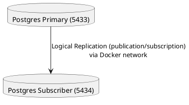

# Central read-only PostgreSQL via logical replication for real-time Metabase visualization without external tools 🐘


---

## 📌 Summary

This project demonstrates **PostgreSQL logical replication** between two isolated Postgres instances running in Docker containers on your local machine. It’s not just a basic demo — the setup is automated, runs integration tests for **insert/update/delete replication**, and verifies data integrity end-to-end.

Why this matters:
- You can **prototype CDC pipelines locally** without needing a cloud environment.
- All replication settings, networking, and data validation are done for you.
- It’s easy to reset and rerun, so you can repeatedly test scenarios.

---

## 🏗 Architecture



- **Primary**: `postgres-db` database on **port 5433** (localhost)
- **Subscriber**: `replication-db` database on **port 5434** (localhost)
- **Replication**: Asynchronous, real-time **logical replication** (publication/subscription model)

---

## 📂 Project Structure

```
.
├── docker-compose.yml          # Defines the two PostgreSQL services + shared network
├── setup.sh                    # Orchestrates everything: start DBs, set up replication, run tests
├── primary/
│   ├── postgresql.conf          # Primary DB settings (logical replication enabled)
│   └── pg_hba.conf              # Host-based access control for replication connections
└── schema.sql                   # Auto-generated schema dump for replication verification
```

---

## ⚡ Usage (Quickstart)

**Requirements:**
- Docker
- Docker Compose
- Bash shell (Linux, macOS, WSL, or Git Bash on Windows)

### 1. Clone the repository
```bash
git clone <your-repo-url>
cd postgresql-replication
```

### 2. Ensure config files exist
Required in `primary/`:
- `postgresql.conf`
- `pg_hba.conf`

(Use provided sample config below if missing.)

### 3. Make the setup script executable
```bash
chmod +x setup.sh
```

### 4. Run the setup
```bash
./setup.sh
```

---

## 🔍 What happens in `setup.sh`

1. **Starts two Postgres containers** (`primary` and `subscriber`) with the correct ports and network settings.
2. **Waits for both databases** to be ready.
3. **Configures logical replication**:
   - Creates the publication on the primary.
   - Creates the subscription on the subscriber.
4. **Creates a test table** and verifies a single-row replication works.
5. **Runs automated integration tests**:
   - Bulk insert (100 rows) → checks all appear on subscriber.
   - Bulk update → ensures updates replicate fully.
   - Bulk delete → ensures deletions replicate.
6. **Prints a clear pass/fail result** for each stage.

---

## ⚙ Configuration

### `primary/postgresql.conf`
```conf
listen_addresses = '*'
wal_level = logical
max_replication_slots = 10
max_wal_senders = 10
max_logical_replication_workers = 10
max_worker_processes = 20
shared_preload_libraries = 'pg_stat_statements'
```
> Ensures Postgres is ready for logical replication and can handle multiple replication streams.

### `primary/pg_hba.conf`
```conf
local   all             all                                     trust
host    all             all             127.0.0.1/32            md5
host    all             all             ::1/128                 md5
host    replication     postgres        0.0.0.0/0               md5
host    all             postgres        0.0.0.0/0               md5
```
> This configuration allows replication connections from any container on the Docker network. Safe for local-only setups.

---

## 🛠 Troubleshooting

- **Connection refused** → Use `postgres-primary` as the host name from subscriber, not `localhost`.
- **Containers can’t talk via localhost** → Docker services must communicate using service names.
- **Schema already exists** → Harmless; setup is idempotent.
- **Permission denied** → Ensure `chmod +x setup.sh` is run before executing.
- **Multiple primary keys** → Always create/import schema *before* setting up publications.

---

## 📝 Example Output
```
🧹 Cleaning up previous setup...

🚀 Starting Postgres containers...

⏳ Waiting for databases to become ready...

📦 Creating test tables in primary if missing...

✅ SUCCESS: Data replicated! 'test_replication_1754397274' found in subscriber.

➕ Inserting 100 rows into 'replication_bulk' on primary...
✅ Insert test: 100 rows successfully replicated to subscriber.
✅ Update test: All 100 rows were updated and replicated.
✅ Delete test: All rows deleted in subscriber.

🎉 All massive replication tests passed!
```

---

## 📜 License
MIT (or your preferred license)

---

## 📚 Quick Reference Guide (INSTRUCTION.md style)

### 1. Prerequisites
- Docker + Docker Compose
- Bash shell

### 2. Setup Steps
```bash
git clone <your-repo-url>
cd postgresql-replication
chmod +x setup.sh
./setup.sh
```

### 3. Reset / Clean Up
```bash
./setup.sh               # Re-run from scratch
docker compose down -v   # Stop and remove all containers + volumes
```

### 4. Customization
- Add tables → Edit `setup.sh` before publication/subscription creation.
- Change DB credentials → Edit variables in `setup.sh` and `docker-compose.yml`.
- Adjust replication behavior → See PostgreSQL logical replication docs.

---

## 📂 SQL Setup Files

For manual database setup (without running `setup.sh`), you can use:

**`publication-setup.sql`** (Run on PRIMARY)
- Configures logical replication parameters
- Creates replication user
- Creates publication for target schema/tables

**`subscription-setup.sql`** (Run on SUBSCRIBER)
- Ensures matching schema/tables exist
- Creates subscription to the primary’s publication

Example:
```bash
psql -h localhost -p 5433 -U postgres -d postgres-db -f publication-setup.sql
psql -h localhost -p 5434 -U postgres -d replication-db -f subscription-setup.sql
```